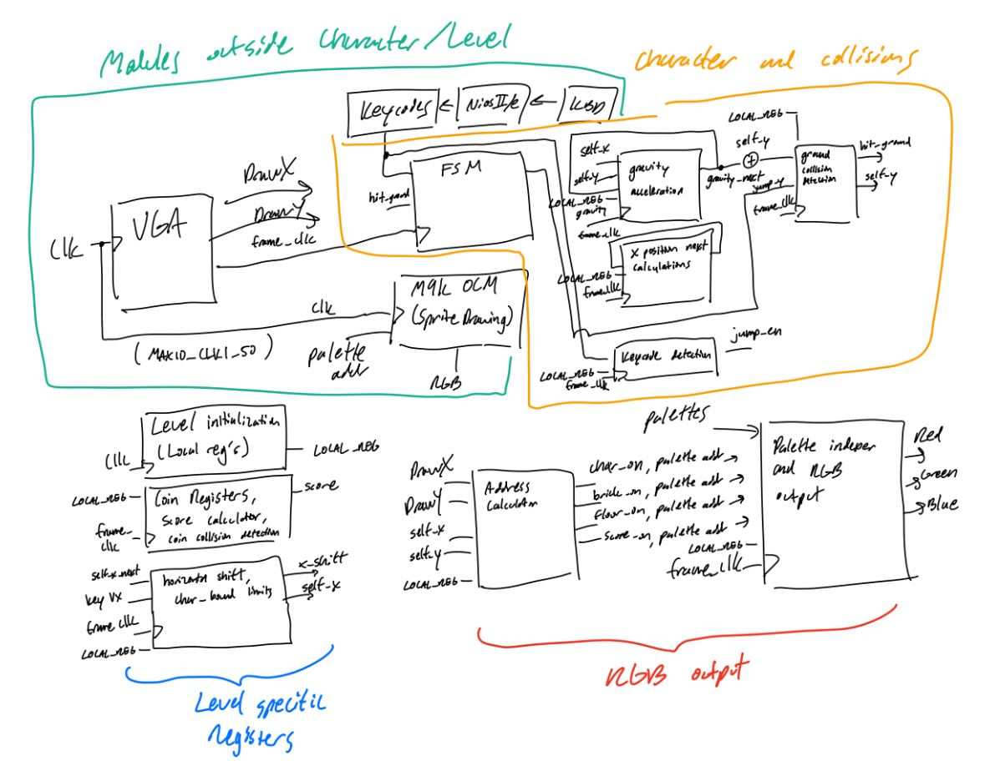

# ECE385 Final Project
### Nathen Smith, Pratheek Eravelli

<p align="center">
  
</p>

## Running Instructions
First, the project must be opened in Quartus Prime, selecting the ```.qpf``` file. 
From there, hit Start Compilation to generate the ```.sof``` file. When complete,
program the FPGA using the programmer. Then, open Nios II and select ```<CURRENT DIRECTORY>/software/```
as the working directory. Nios II Eclipse will start and no files will show up.
Import the ```usb_kb/``` ```usb_kb_bsp/``` both as ```Nios II Software Build Tools Project->Import Custom Makefile for Nios II Software Build Tools Project```.
Name the project name as their respective folders. Go to ```Run->Run Configurations``` and select ```Nios II Hardware->New Configuration``` and select ```usb_kb```
from the dropdown for project name. Refresh the connection and hit run, when the keycode printing show up on the Nios II Console it is run.

Note: If reset timeout prints, stroke the IO Shield until it goes away and proceeds to show keycode prints.

## Introduction
This project implements a playable version of the NES (Nintendo Entertainment System) version of Super Mario Brothers. The project is rendered entirely on the FPGA using hardware, the only software elements coming from the USB interface with the keyboard. Key elements include, sprite drawing, collision detections, maintaining score, and screen panning. The game itself is a single level with 3 collectables each of which is worth 1 point. There are no enemies in this version of the game and the level is about 3 screen lengths long. On death, falling in the hole at the end of the level, the game resets, putting the score at 0 and placing the coins back onto their original location. 

This project is primarily a showcase in collision detection and motion control through the FPGA and state machines. 

### Written Description of Final Project and Collision Detection
The backbone of this lab uses some of the design from Lab 6. From lab 6 we take the VGA_controller, the USB SPI interface with the keyboard, and some of the framework on how to actually draw to the screen.

The level is retained in local registers—continually loaded on each MAX10_CLK1_50 (50 Hz clock) , ```logic [2:0] LOCAL_REG [15][60];```. The level is stored using local registers and is stored in 900 3-bit registers with asynchronous reset. Each of the registers represents a 32 x 32 pixel region of the screen. We condition upon the MSB of the 3 bit code to determine whether a block is solid or not. Since there are many accesses happening to the level, up to 100 every clock cycle, using ram for the level would be less ideal.

Additionally, there are coins loaded into the level and upon collision, turn into the sky block. There is a total score that adds up the number of coin registers that are turned off, and will always display on top of the level.

Besides the level, there are many registers detailing character position, allowed velocity, gravity that all combine collision detection from all four corners and (horizontally and vertically). Vertical movement is more complicated than horizontal since it combines a gravity register and a simple jump state machine, which outputs a number to change the y velocity. The next value of gravity is computed by adding to the previous value (output is fed back into the register) and it is limited to a maximum (similar to terminal velocity). Combined with the state machine, there is a maximum that the gravity can bring the character into free fall. To avoid collisions, we follow a simple brute force-like algorithm, which is also re-used for jump ceiling collision:

```python3
def collision_free_fall(self_x, self_y, gravity_prev):
    v_increase ← 1 # acceleration is one pixel for each frame clock cycle
    if (gravity_prev + v_increase) is not a collision:
        if  (gravity_prev + v_increase) > v_terminal:
            return v_terminal
        return gravity_prev + v_increase
    else:
        # collision brute force
        for distance in reversed range of v_terminal:
        # find the largest distance that does not cause a collision
        # and return it
```

The same algorithm is used for computing the next possible x velocities for left and right, which are only used when the respective keycodes for left and right are pressed. The keycodes detection is clocked like in lab 6, since they are interrupts. Based on the keycode, we give a flag for the state machine to start the jump sequence and another flag to determine what direction the character should face. After that, we have an interrupt for the state machine, in case the state machine is still running after the character has landed, so there is no delay in between jumping.

Lastly for movement, there is screen panning, where essentially a global register is added to once the character reaches defined invisible walls. Whenever there is movement when the character is at the wall, we set the x position to that wall, and add the velocity determined from the keycode and the collision checking.

As for RGB displaying, we index into the sprite by giving an address to the respective ram, and set a flag for what ram to take the output from. As briefly mentioned before, there is a special flag for changing the indexing of what way Mario should face. 

## Sprite Drawing
We instantiate each of the rams in game.sv. Each of these rams is instantiated and a local decoder selects a color based on the data stored in the ram. This makes sense to do because instead of having to store 24 * 32 * 32 bits in each ram we only have to store 3*32*32 bits which cuts our memory usage in eight. 

```systemverilog
logic [23:0] mario_pallete [7];
assign mario_pallete[0] = 24'hE00B8E;
assign mario_pallete[1] = 24'hF83800;
assign mario_pallete[2] = 24'hE09230;
assign mario_pallete[3] = 24'hEA9A30;
assign mario_pallete[4] = 24'hEF9D34;
assign mario_pallete[5] = 24'hffa440;
assign mario_pallete[6] = 24'hac7c00;
```

The palette is hard coded so that each 3 bit word inside the instantiated ram module has a corresponding color. 

## Block Diagram

